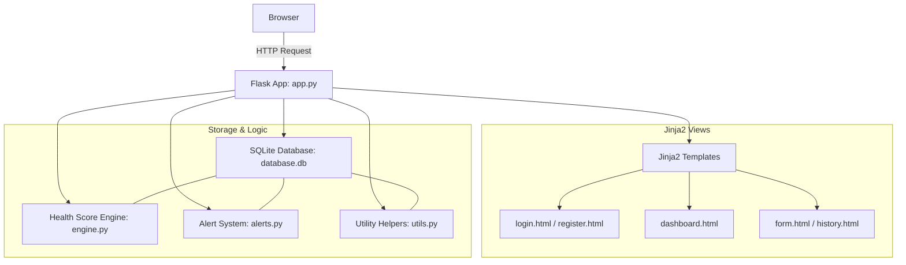

# Personal Health Monitoring System (HMS)

A production-ready, single-service Flask web application for tracking daily health metrics, computing health scores, generating smart alerts, and visualizing health trends. It features a beautiful, responsive dark-mode glassmorphism interface with interactive data visualization, CSV import capabilities, and PDF export reporting.

---

## 🚀 Key Features

- **User Authentication**: Secure registration and session-based login with hashed passwords via `werkzeug.security`.
- **Health Score Engine**: A weighted scoring algorithm that evaluates daily sleep duration, step count, and vitals (blood pressure & heart rate) to output a health score from `0` to `100`.
- **Intelligent Alert System**: Automatically monitors vitals for critical thresholds, evaluates consecutive poor sleep, performs missing data check-ins, and identifies significant health score deviations.
- **Dynamic Baselines**: Evaluates historical data after 7 entries to establish a personal health baseline, allowing the system to customize alert triggers.
- **Interactive Dashboards**: Modern responsive analytics panels using Chart.js to display 7-day health trends (activity, sleep, and overall score).
- **Data Portability**: 
  - **CSV Upload**: Bulk import historical data logs at once.
  - **PDF Export**: Generate and download structured weekly health reports using `fpdf2`.
- **Streak Tracker**: Gamifies health tracking by monitoring consecutive days logged.

---

## 🛠️ Tech Stack

- **Core**: Python (Flask)
- **Database**: SQLite (SQLAlchemy ORM via Flask-SQLAlchemy)
- **Frontend**: HTML5, Vanilla CSS (Glassmorphism layout), JavaScript (Chart.js CDN, custom interactions)
- **PDF Generation**: `fpdf2`
- **WSGI Production Server**: Gunicorn

---

## 📂 Project Structure

```
HMS/
├── app.py                  # Flask app factory, routes, configuration
├── models.py               # SQLAlchemy ORM models (User, DailyLog, Alert)
├── engine.py               # Health score calculation algorithm
├── alerts.py               # Alert generation, missing data, baseline logic
├── utils.py                # CSV parser, PDF report generator, streak calculator
├── requirements.txt        # Python dependency list
├── Procfile                # Heroku/Render process command file
├── render.yaml             # Render deployment configuration
├── templates/              # Jinja2 HTML templates
│   ├── base.html           # Main base layout (Sidebar nav, flash messages)
│   ├── login.html          # Login card
│   ├── register.html       # Register card
│   ├── dashboard.html      # Stats dashboard, gauge, alerts, and trend charts
│   ├── form.html           # Universal daily log entry (add/edit)
│   └── history.html        # Historical records list, CSV upload, PDF download
└── static/                 # Static assets
    ├── style.css           # Global custom theme & animations (Dark CSS)
    └── script.js           # Chart.js initialization & dynamic UI handlers
```

---

## 📐 Architecture & Workflow



---

## 💻 Local Installation & Setup

Follow these steps to run the application locally on your machine:

### Prerequisites
- Python 3.10 or higher installed.

### Steps
1. **Navigate to the Project Root**:
   ```bash
   cd HMS
   ```

2. **Create a Virtual Environment**:
   ```bash
   python -m venv .venv
   ```

3. **Activate the Virtual Environment**:
   * **Windows (Command Prompt)**:
     ```cmd
     .venv\Scripts\activate.bat
     ```
   * **Windows (PowerShell)**:
     ```powershell
     .venv\Scripts\Activate.ps1
     ```
   * **macOS/Linux**:
     ```bash
     source .venv/bin/activate
     ```

4. **Install Dependencies**:
   ```bash
   pip install -r requirements.txt
   ```

5. **Start the Flask Development Server**:
   ```bash
   python app.py
   ```

6. **Access the Application**:
   Open your browser and navigate to `http://localhost:10000`.

---

## 🌐 Production Deployment

The project is preconfigured for deployment on platforms like [Render](https://render.com) using the provided `render.yaml` configuration.

### Render Configuration Details
- **Build Command**: `pip install -r requirements.txt`
- **Start Command**: `gunicorn app:app`
- **Python Version**: `3.10.0`
- **Web Service Name**: `health-monitoring-system`

---

## 📝 License
This project is licensed under the MIT License.