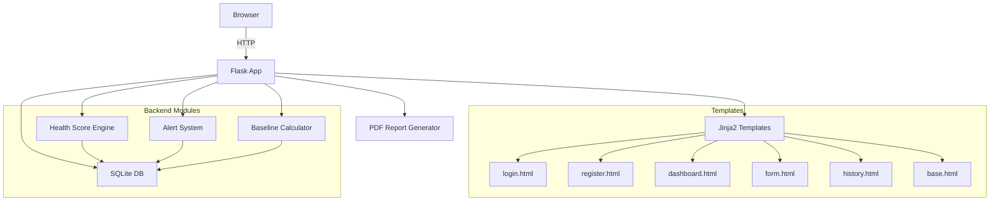

# Personal Health Monitoring System — Implementation Plan

A production-structured, single-service Flask web application for tracking daily health metrics, computing health scores, generating smart alerts, and visualizing trends.

## Architecture Overview



## Project Structure

```
HMS/
├── app.py                  # Flask app factory, routes, config
├── models.py               # SQLAlchemy models (User, DailyLog, Alert)
├── engine.py               # Health score calculation engine
├── alerts.py               # Alert generation & baseline logic
├── utils.py                # CSV parser, PDF generator, helpers
├── requirements.txt        # Dependencies
├── database.db             # SQLite (auto-created at first run)
├── templates/
│   ├── base.html           # Base layout (nav, footer, flash messages)
│   ├── login.html
│   ├── register.html
│   ├── dashboard.html      # Main dashboard with score, alerts, chart, logs
│   ├── form.html           # Add / Edit daily log
│   └── history.html        # Full log history + CSV upload + PDF export
├── static/
│   ├── style.css           # Global styles (dark theme, responsive)
│   └── script.js           # Chart.js rendering, UI interactions
```

## Proposed Changes

### Database Layer

#### [NEW] [models.py](file:///c:/Users/Nikhil Sharma/PROJECTS/HMS/models.py)

SQLAlchemy ORM models using `flask_sqlalchemy`:

| Table | Columns |
|-------|---------|
| `users` | `id`, `name`, `email` (unique), `password_hash`, `created_at` |
| `daily_logs` | `id`, `user_id` (FK), `date` (unique per user), `steps`, `sleep_hours`, `bp_systolic`, `bp_diastolic`, `heart_rate`, `weight`, `water_intake`, `score` |
| `alerts` | `id`, `user_id` (FK), `message`, `severity` (warning/critical), `date`, `is_read` |

> [!NOTE]
> Blood pressure is stored as two integer columns (`bp_systolic`, `bp_diastolic`) rather than a string for proper numerical comparison in alert logic.

---

### Authentication System

#### [NEW] [app.py](file:///c:/Users/Nikhil Sharma/PROJECTS/HMS/app.py) — Auth Routes

- `GET/POST /login` — Email + password login, session-based auth via `flask.session`
- `GET/POST /register` — Name, email, password with `werkzeug.security.generate_password_hash`
- `GET /logout` — Clear session, redirect to login
- `@login_required` decorator — Protects all dashboard/data routes
- Error handling for duplicate emails, invalid credentials, missing fields

---

### Health Score Engine

#### [NEW] [engine.py](file:///c:/Users/Nikhil Sharma/PROJECTS/HMS/engine.py)

Scoring formula (0–100 scale):

| Component | Weight | Scoring Logic |
|-----------|--------|---------------|
| Sleep | 30% | Optimal: 7–9h → 100, 6h or 10h → 70, <5h or >11h → 30 |
| Activity | 40% | 10,000+ steps → 100, linear scale down to 0 steps → 0 |
| Vitals | 30% | Composite of BP (systolic 90–120 ideal) + HR (60–100 ideal) |

- `compute_score(log) -> int` — Pure function, returns 0–100
- Score stored in `daily_logs.score` on each save

---

### Alert System

#### [NEW] [alerts.py](file:///c:/Users/Nikhil Sharma/PROJECTS/HMS/alerts.py)

Alert triggers:

| Condition | Severity | Message |
|-----------|----------|---------|
| BP systolic > 140 | **Critical** | High blood pressure detected |
| BP systolic < 90 | Warning | Low blood pressure detected |
| Sleep < 5h (2+ consecutive days) | **Critical** | Consecutive poor sleep |
| Heart rate > 120 or < 50 | Warning / Critical | Abnormal heart rate |
| Missing log for yesterday | Warning | No data logged yesterday |
| Score deviation > 20 from baseline | Warning | Significant score change |

- `generate_alerts(user_id, log) -> list[Alert]` — Creates and persists alerts
- `check_missing_data(user_id)` — Called on dashboard load
- Baseline-aware: after 7+ logs, alerts adjust to personal baseline

---

### Personal Baseline

#### Part of [alerts.py](file:///c:/Users/Nikhil Sharma/PROJECTS/HMS/alerts.py)

- `calculate_baseline(user_id) -> dict` — Averages from first 7 daily logs
- Returns `avg_steps`, `avg_sleep`, `avg_bp_systolic`, `avg_hr`, `avg_score`
- Used by alert system to detect deviations from personal norms
- Falls back to population defaults if fewer than 7 logs exist

---

### Dashboard & Routes

#### [NEW] [app.py](file:///c:/Users/Nikhil Sharma/PROJECTS/HMS/app.py) — Data Routes

| Route | Method | Purpose |
|-------|--------|---------|
| `/` | GET | Redirect → dashboard or login |
| `/dashboard` | GET | Main dashboard (today's data, score, alerts, recent logs, charts) |
| `/log/add` | GET/POST | Add daily log form |
| `/log/edit/<id>` | GET/POST | Edit existing log |
| `/log/delete/<id>` | POST | Delete log entry |
| `/history` | GET | Full log history table |
| `/upload-csv` | POST | Bulk CSV import |
| `/export-pdf` | GET | Download weekly PDF report |
| `/alerts/read/<id>` | POST | Mark alert as read |

---

### Templates

#### [NEW] [base.html](file:///c:/Users/Nikhil Sharma/PROJECTS/HMS/templates/base.html)
- Responsive layout with sidebar navigation
- Flash message display
- Dark theme with CSS variables
- Chart.js CDN, Google Fonts (Inter)

#### [NEW] [login.html](file:///c:/Users/Nikhil Sharma/PROJECTS/HMS/templates/login.html)
- Centered card layout, email + password inputs
- Link to register page
- Error display for invalid credentials

#### [NEW] [register.html](file:///c:/Users/Nikhil Sharma/PROJECTS/HMS/templates/register.html)
- Name, email, password, confirm password
- Validation feedback
- Link to login page

#### [NEW] [dashboard.html](file:///c:/Users/Nikhil Sharma/PROJECTS/HMS/templates/dashboard.html)
- **Hero card**: Today's health score (circular gauge via CSS)
- **Alerts panel**: Color-coded (yellow warning, red critical)
- **Quick stats**: Steps, sleep, BP, HR, weight, water — card grid
- **Charts**: Steps trend, sleep trend, score trend (7-day)
- **Recent logs table**: Last 7 entries
- **Streak counter**: Consecutive days logged

#### [NEW] [form.html](file:///c:/Users/Nikhil Sharma/PROJECTS/HMS/templates/form.html)
- Dual-purpose add/edit form
- Input fields for all health metrics
- Date picker (defaults to today)
- Validation (min/max ranges)

#### [NEW] [history.html](file:///c:/Users/Nikhil Sharma/PROJECTS/HMS/templates/history.html)
- Full log table with edit/delete actions
- CSV upload form
- PDF export button
- Pagination or scroll

---

### Static Assets

#### [NEW] [style.css](file:///c:/Users/Nikhil Sharma/PROJECTS/HMS/static/style.css)

Design system:
- **Theme**: Dark mode with glassmorphism cards
- **Colors**: Deep navy background (`#0a0e27`), accent gradients (cyan-to-purple)
- **Typography**: Inter (Google Fonts)
- **Cards**: Frosted glass effect, subtle borders
- **Responsive**: Flexbox/Grid, mobile-first breakpoints
- **Animations**: Fade-in on load, hover scale on cards, pulse on alerts
- **Score gauge**: CSS-only circular progress indicator
- **Form inputs**: Styled with focus glow effects

#### [NEW] [script.js](file:///c:/Users/Nikhil Sharma/PROJECTS/HMS/static/script.js)

- Chart.js initialization for 3 charts (steps, sleep, score trends)
- Data passed via Jinja2 `{{ data | tojson }}` into `<script>` tags
- Responsive chart options
- Form validation helpers
- Alert dismiss interaction

---

### Utilities

#### [NEW] [utils.py](file:///c:/Users/Nikhil Sharma/PROJECTS/HMS/utils.py)

- `parse_csv(file) -> list[dict]` — Validates and parses uploaded CSV
- `generate_pdf_report(user, logs, score_avg) -> BytesIO` — Weekly PDF using `fpdf2`
- `calculate_streak(user_id) -> int` — Counts consecutive logged days from today backwards

---

### Dependencies

#### [NEW] [requirements.txt](file:///c:/Users/Nikhil Sharma/PROJECTS/HMS/requirements.txt)

```
flask
flask-sqlalchemy
werkzeug
fpdf2
```

> [!IMPORTANT]
> All dependencies are lightweight. No heavy frameworks. `fpdf2` is the maintained fork of FPDF for PDF generation.

---

## Design Decisions

1. **Single `app.py`** — All routes in one file for simplicity, but logic is modularized into `engine.py`, `alerts.py`, `utils.py`
2. **`flask-sqlalchemy`** over raw SQL — Cleaner ORM syntax while staying beginner-friendly
3. **`werkzeug.security`** for password hashing — Ships with Flask, no extra dependency
4. **`fpdf2`** over `reportlab` — Lighter, simpler API, better maintained
5. **Session-based auth** — `flask.session` with `SECRET_KEY`, no JWT complexity
6. **Chart.js via CDN** — No build step, works with server-rendered templates
7. **Dark glassmorphism theme** — Modern, visually impressive, accessible

## Verification Plan

### Automated Tests
```bash
pip install -r requirements.txt
python app.py
```
- App should start on `http://localhost:5000`
- Register a new user → Login → Add logs → View dashboard

### Browser Verification
1. **Auth flow**: Register → Login → Logout → Login again
2. **Data entry**: Add log → Edit → Delete → Verify DB state
3. **Dashboard**: Score display, alerts, charts render correctly
4. **History**: Table populates, CSV upload works, PDF downloads
5. **Responsive**: Test at mobile/tablet/desktop widths
6. **Alerts**: Trigger critical/warning conditions, verify display
7. **Streak**: Log consecutive days, verify counter
